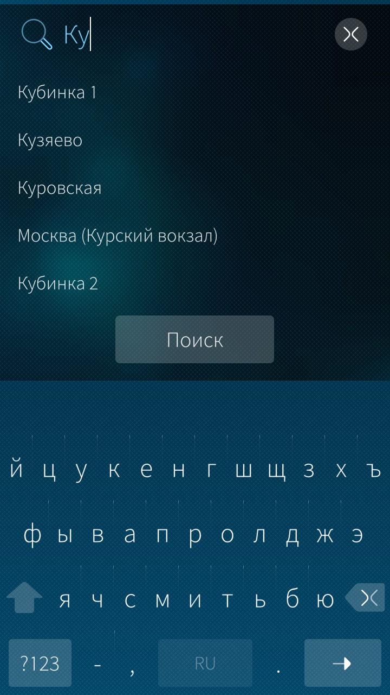
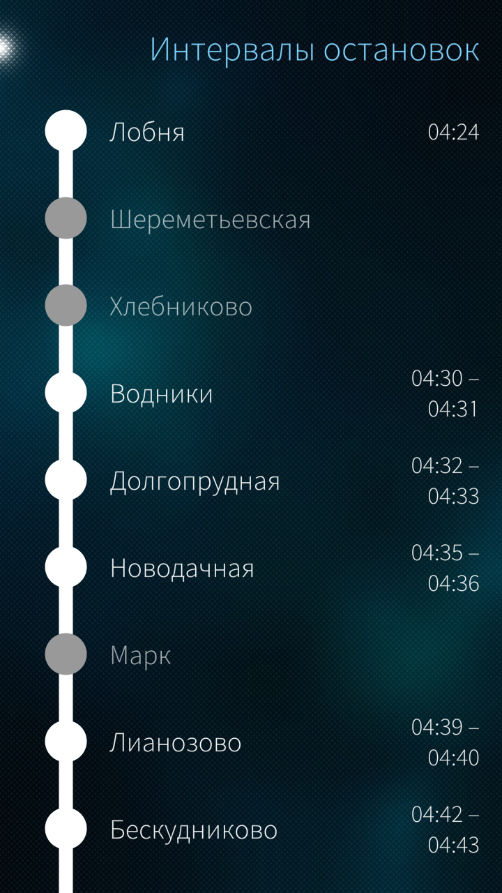

# Suburban Trains

###### Расписание электричек под Sailfish OS.   Доступно на [OpenRepos](https://openrepos.net/content/euf/suburban-trains).

## Описание

Приложение показывает расписание на электрички в России и некоторых других странах, используя данные Яндекс.Расписаний.

## Скриншоты

 
 
 
 

Начальная страница, поиск станции, страница с маршрутами, описание маршрута с интервалами.

## Светлое будущее
- [ ] Проматывать `ThreadsPage` к ближайшему по времени поезду
- [ ] Если искались поезда на сегодня, то на **Cover** выводим ближайший поезд и кнопку обновить, иначе скриншот
- [ ] Избранные или последние маршруты
- [ ] Оффлайн расписание?
- [ ] Проверять актуальность базы (смотреть `ETag`?) Если старая, то скачать XML, превратить в **sqlite** и обновить

## Файлы QML
- `qml/harbour-subtrains.qml` — корневой qml приложения;
- `qml/cover/CoverPage.qml` — Cover приложения;
- `qml/pages/AboutPage.qml` — страница "О программе";
- `qml/pages/FirstPage.qml` — начальная страница приложения (где показывается регион, дата, поиск и т.п.);
- `qml/pages/ThreadsPage.qml` — страница с маршрутами по направлению, где показаны электрички с необходимым маршрутом;
- `qml/pages/ThreadInfo.qml` — страница с названиями и временными интервалами остановок выбранного маршрута;
- `qml/pages/ZonePage.qml` — страница с выбором пригородной зоны.
